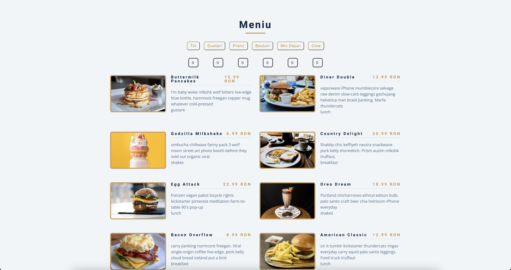

# Interactive Restaurant Menu

[](#)
> A dynamic and visually appealing restaurant menu that allows users to browse food items with filters and detailed images for each dish. The design ensures a clean user experience, making it easy for customers to find their desired meals.

## Overview

**Interactive Restaurant Menu** is a web-based menu system that enables users to filter dishes by categories, view images, and get details about each food item. The UI is structured for a smooth browsing experience with a responsive design.

## Preview

<p align="center">
  
</p>

## Features

- **Filterable Menu:** Users can filter menu items by category (e.g., Breakfast, Lunch, Drinks, Desserts, etc.).
- **Detailed Food Descriptions:** Each menu item includes a name, price, and description.
- **High-Quality Images:** Every dish is displayed with an appealing, high-resolution image.
- **Responsive Design:** Ensures a seamless experience on all devices.

## Live Demo

**Explore the live version here:** [View Live Demo](https://marius-bogdan.com/projects/interactive-restaurant-menu/)

## Local Setup

1. **Clone** the repository:
   ```bash
   git clone https://github.com/MIBogdan/interactive-restaurant-menu.git
   ```
2. **Open** the `index.html` file in your browser
   *- or use a local development server (like VS Code Live Server) for a smoother development experience.*

---

## Author

**Marius Bogdan**  
[Personal portfolio](https://marius-bogdan.com/)

Feel free to reach out for any questions or collaborations!

## License

This project is provided for testing and demonstration purposes only. All rights are reserved. No part of this project may be redistributed, reuploaded, or used in any manner (commercially or otherwise) without explicit written permission from the author.
